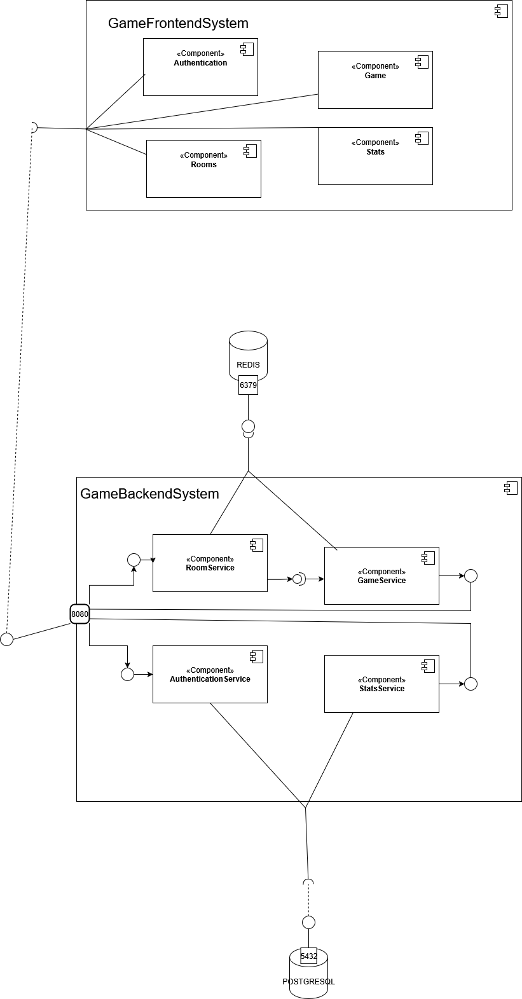
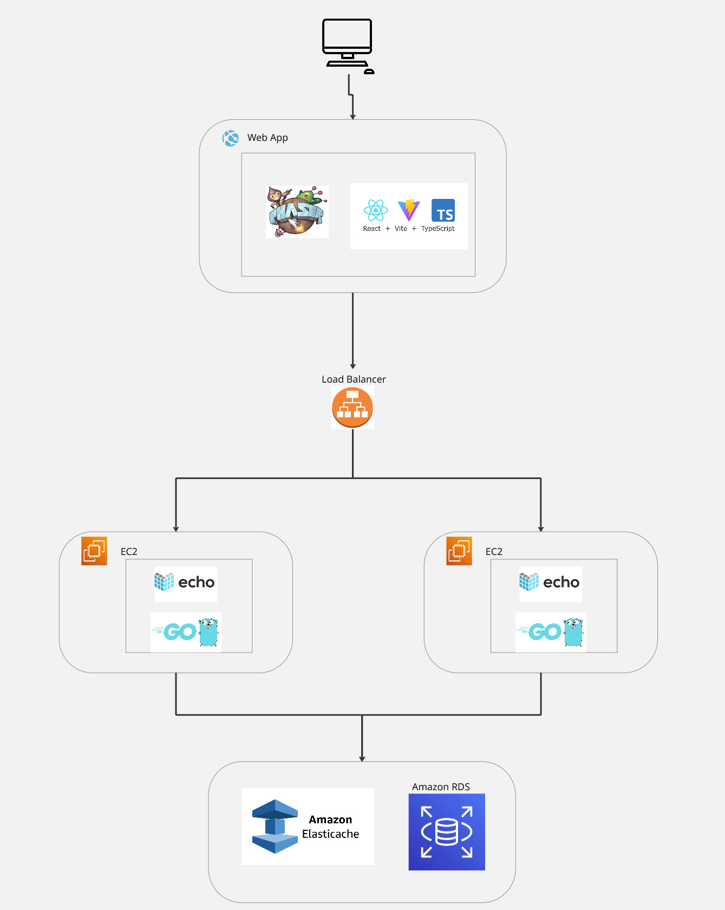

# 🕹️ Tank Top Battle

Este es el backend de un juego multijugador desarrollado en Go. Utiliza WebSockets para comunicación en tiempo real entre jugadores y Redis para la gestión de salas y estado del juego.

## 🚀 Características

- Comunicación en tiempo real con WebSockets
- Soporte para múltiples salas de juego
- Gestión de jugadores y sincronización de estado
- Persistencia opcional con Redis
- Modular y fácil de extender

## 📦 Tecnologías

- [Go](https://golang.org/)
- [Gorilla WebSocket](https://github.com/gorilla/websocket)
- [Redis](https://redis.io/) 
- [PostgreSql](https://www.postgresql.org/)

## 📁 Estructura del proyecto

```
/game-backend
├── cmd/               # Punto de entrada de la app (main.go)
├── internal/          # Código interno del dominio del juego
│   ├── game/          # Lógica principal del juego
│   ├── player/        # Manejo de jugadores
│   └── room/          # Lógica de salas
├── websocket/         # Manejo de conexiones WebSocket
├── redis/             # Adaptador para almacenamiento en Redis
├── go.mod / go.sum    # Dependencias del proyecto
└── README.md          # Este archivo
```

## Architecture


## Infrastructure


## ⚙️ Instalación

### Prerrequisitos

- Go 1.20+
- Redis 
- Git

### Clonar el repositorio

```bash
git clone https://github.com/thesrcielos/TopTankBattle.git
cd TopTankBattle
```

### Instalar dependencias

```bash
go mod tidy
```

### Configurar variables de entorno

Crea un archivo `.env`:

```env
DB_HOST=host
DB_PORT=puerto
DB_USER=user
DB_PASSWORD=password
DB_NAME=name
JWT_SECRET=secret
REDIS_ADDR=addr
REDIS_PASSWORD=password
REDIS_USERNAME=usernmae
REDIS_DB=db
```

## ▶️ Ejecutar el servidor

```bash
go run cmd/main.go
```

El servidor WebSocket estará disponible en:  
`ws://localhost:8080/game`

## 🧪 Pruebas

Puedes usar herramientas como `wscat` para probar:

```bash
wscat -c ws://localhost:8080/game
```

## 📌 Endpoints WebSocket

- `/game`: conecta jugadores a una sala
- Mensajes soportados:
  - `LEAVE_ROOM`
  - `MOVE`
  - `SHOOT`
  - `GAME_START`

## 🧱 Contribuir

1. Haz un fork del proyecto
2. Crea una rama con tu feature
3. Haz un PR describiendo tus cambios

## 📄 Licencia

Este proyecto está bajo la licencia MIT.

---

**Desarrollado por Diego Armando Macia Diaz 🎮**
